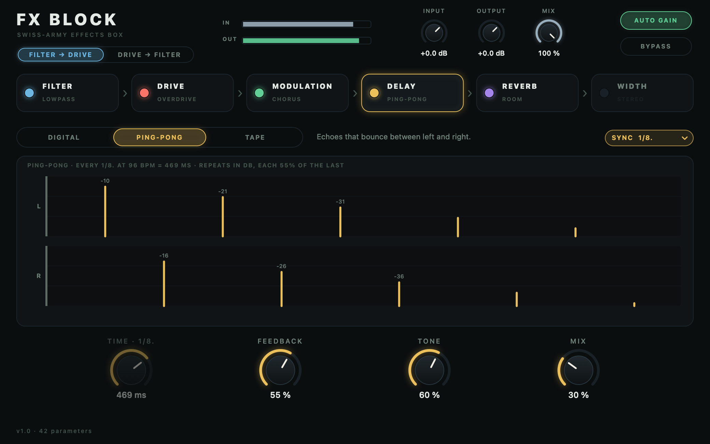

# FX Block

A swiss-army effects box, as a CLAP plugin for macOS: six blocks in a chain, **Filter → Drive → Modulation → Delay → Reverb → Width**, and each block comes in three flavors, the three people actually reach for.

| Block | Flavors |
| --- | --- |
| **Filter** | Lowpass · Highpass · Bandpass (12 or 24 dB per octave, with resonance) |
| **Drive** | Overdrive · Fuzz · Crush |
| **Modulation** | Chorus · Flanger · Phaser |
| **Delay** | Digital · Ping-Pong · Tape (free, or synced to the host's tempo) |
| **Reverb** | Room · Hall · Plate |
| **Width** | Stereo (mid/side) · Haas · Spread |



The six blocks run along the top as chips, in signal order. Each chip's light switches its block on and off; clicking its name shows that block's panel: a flavor picker, a graph drawn from the block's own DSP (the filter's measured response, the drive's transfer curve, the modulation sweep, the delay's repeats at the host's tempo, the reverb's decay, the width's image), and three knobs that mean what the flavor says they mean (the numbers are in real units: seconds, bits, milliseconds) plus a **Mix**. Everything is off until you turn it on. Input, Output, a whole-chain Mix, Bypass and an **Auto Gain** that matches the loudness to the dry (so wet and dry compare at the same level) sit across the top, and the filter's chip moves to after the drive's when you choose Drive → Filter.

It adds no latency, runs at about 49× real time with every block on (48 kHz stereo, on the development machine), and the distortion is oversampled and anti-aliased. What it measures, and how, is in [docs/design.md](docs/design.md); what each knob does is in [docs/controls.md](docs/controls.md).

## Build and install

Needs CMake 3.22+, a C++17 compiler and, for the editor, macOS with Xcode's command-line tools.

```sh
cmake -S . -B build -G Ninja -DCMAKE_BUILD_TYPE=Release
cmake --build build
ctest --test-dir build                 # four suites: parameters, blocks, chain, plugin
tools/install_macos.py                 # to ~/Library/Audio/Plug-Ins/CLAP, then rescan in your host
```

`build/FxBlock.clap` is ad-hoc signed. `clap-validator validate build/FxBlock.clap` passes (21 checks, 5 skipped: the note-port ones, which an audio effect does not have).

Tools: `build/editor_snapshot out.png filter.flavor=bandpass drive.on=1 …` renders the editor without a host; `editor_snapshot --selftest` drives it with synthetic clicks and drags. `build/render_demo dir/` writes a WAV of every flavor over a short phrase, to listen to each one. `tools/gen_halfband.py` designs the oversampler.

Cmake option `-DFXBLOCK_SANITIZE=ON` builds everything with AddressSanitizer and UBSan; the tests pass under both.

## Layout

```
src/Parameters.h   the 42 parameters, flavor tables, real-unit mappings, text in and out
src/Blocks.h       the six effects and the Stage that gives each the same on/off, flavor-change and mix behavior
src/Filter.cpp … Width.cpp, Chain.cpp   the DSP
src/Plugin.cpp     the CLAP plugin: ports, parameters, state, remote controls, GUI hooks
src/Editor.mm      the Cocoa editor: header, block chips, one panel per block
src/ui/            its widgets (knob, toggle, picker, meter) and the six DSP-driven graphs
tests/ tools/ docs/
```
